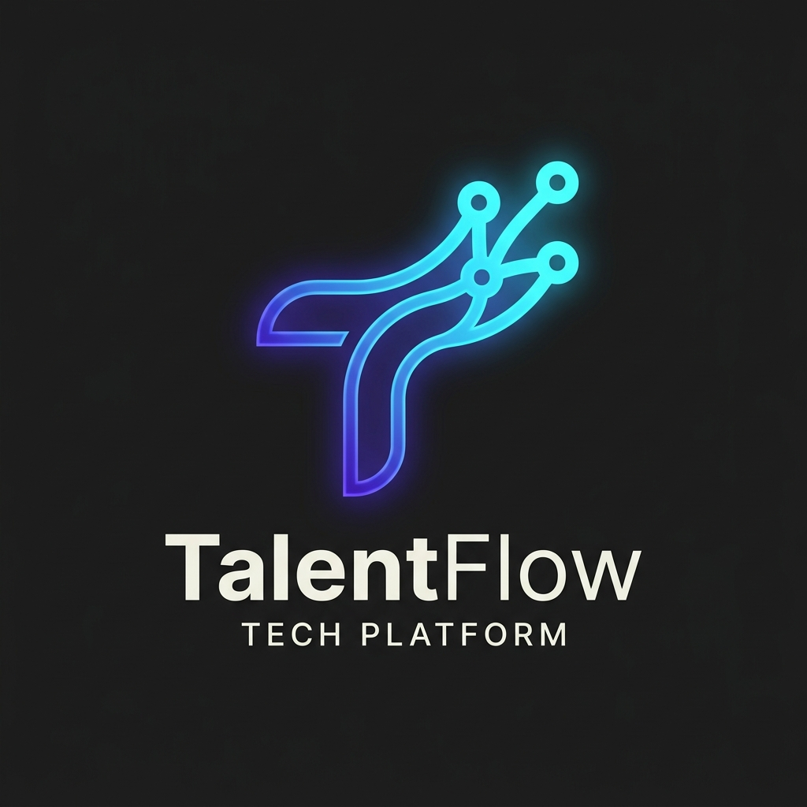
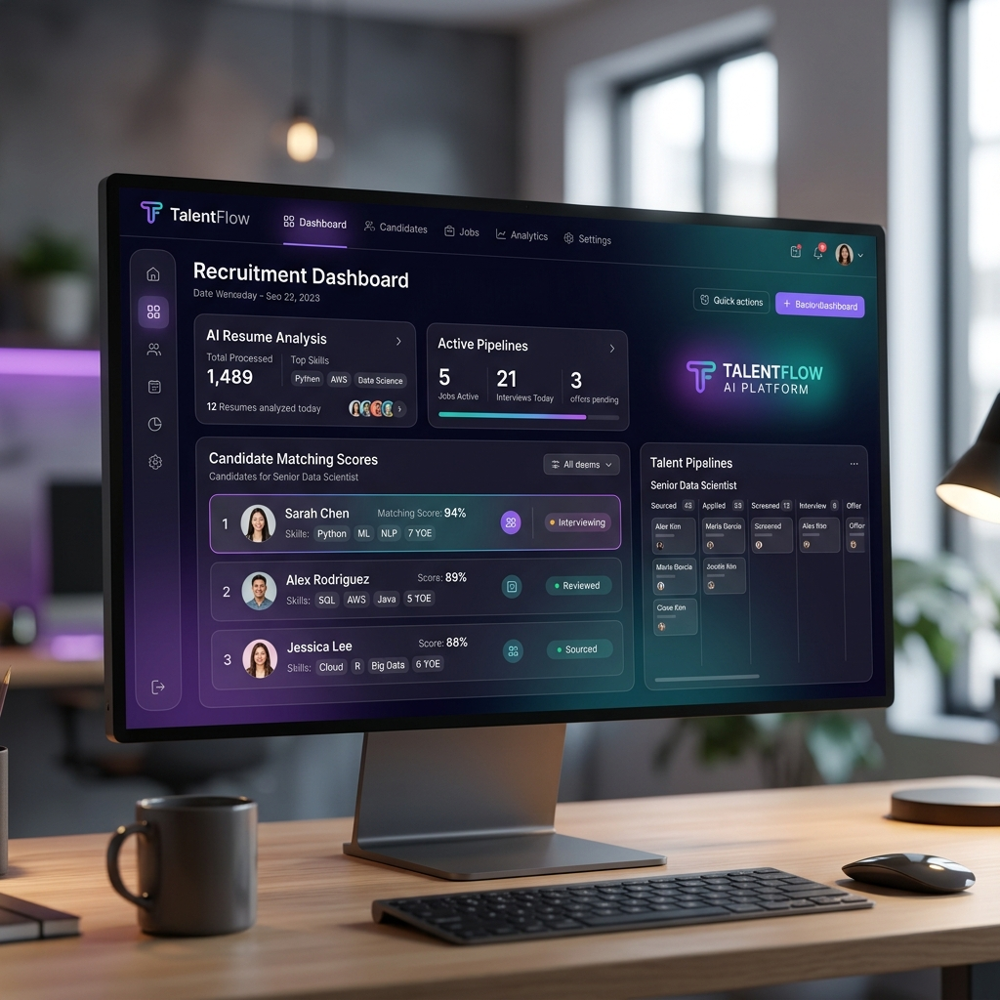

<h1 align="center">
    
</h1>

<p align="center">
  <a href="#-tecnologias">Tecnologias</a>&nbsp;&nbsp;&nbsp;|&nbsp;&nbsp;&nbsp;
  <a href="#-projeto">Projeto</a>&nbsp;&nbsp;&nbsp;|&nbsp;&nbsp;&nbsp;
  <a href="#-instalação">Instalação</a>&nbsp;&nbsp;&nbsp;|&nbsp;&nbsp;&nbsp;
  <a href="#-licença">Licença</a>
</p>

<p align="center">
  <a href="https://github.com/laurielmesquita">
    
  </a>
  
  
  
  
</p>

<p align="center">
  
</p>

<br><br><br>

## 🚀 Tecnologias e Arquitetura (Design Engineering)

Este projeto foi estruturado sob o conceito de **Design Engineering**, unindo processamento backend robusto com uma interface visual de performance cirúrgica (60fps). 

### Backend, Infraestrutura & AI (Data Ingestion)
- **[FastAPI](https://fastapi.tiangolo.com)** — Framework web assíncrono em Python, ideal para fluxos pesados de I/O.
- **[Uvicorn](https://www.uvicorn.org)** — Servidor ASGI de altíssimo desempenho para execução local da API.
- **[Google Gemini API (2.5 Flash)](https://ai.google.dev)** — Modelo multimodal inteligente utilizado para OCR e extração estruturada de PDFs digitalizados/escaneados.
- **[Groq API (Llama 3.3 70B)](https://groq.com)** — Extração de dados estruturados em JSON de arquivos PDF com texto legível com baixíssima latência.
- **[Neon.tech (PostgreSQL)](https://neon.tech)** — Banco de dados relacional serverless hospedado em nuvem para persistência ágil.
- **[Alembic](https://alembic.sqlalchemy.org)** — Ferramenta de versionamento e controle de migrações para esquemas SQL.
- **[Fly.io](https://fly.io)** — Hospedagem automatizada e deploy contínuo em servidores distribuídos globalmente.
- **[Bcrypt & PyJWT](https://pyjwt.readthedocs.io)** — Cifragem segura de senhas via `bcrypt` e gerenciamento de sessões com JWT assinados via `pyjwt`.
- **[Brevo SMTP](https://www.brevo.com)** — Servidor SMTP transacional integrado para disparos de e-mails automatizados TLS.


### Frontend & UI Experience (Camada de Visão)
- **[Next.js v16](https://nextjs.org) & [React v19](https://react.dev)** — Utilizando o *App Router* para isolamento estrito entre server/client components, assegurando performance no *First Contentful Paint*.
- **[Tailwind CSS v4](https://tailwindcss.com) (CSS-First)** — Todo o *Design System* foi refatorado para operar no espaço de cores perceptual **OKLCH**. Isso provê controle matemático sobre Luminância e Croma, blindando a UI contra *Gamut Clipping* no Dark Mode.
- **[21st.dev](https://21st.dev)** — Hub e referência principal para inspiração e injeção de componentes e micro-interações animadas em Tailwind CSS e Framer Motion.
- **[Framer Motion](https://www.framer.com/motion/)** — Motor de física de mola (spring) do projeto, alimentando as transições de cards, modais e layouts elásticos.
- **[Base UI](https://base-ui.com)** — Biblioteca de componentes headless e unstyled focada em acessibilidade (WAI-ARIA) para abas e formulários.
- **[Shadcn/ui](https://shadcn.dev)** — Fundação de componentes primitivos do ecossistema.
- **[Next-Themes](https://github.com/pacocoursey/next-themes)** — Gestão de *Dual-Theme* isolada no servidor/cliente sem disparar os temidos erros de *Hydration Mismatch*.

## 💻 Projeto

O **TalentFlow** é uma plataforma de triagem SaaS Tier-1 focada em otimização do pipeline de Recrutamento e Seleção (R&S). A aplicação foca na intersecção perfeita entre inteligência artificial e design fluido.

### Principais Funcionalidades (Resumo)
* **Ingestão Inteligente:** Extração automática de dados de qualquer PDF (texto ou escaneado/imagem) e anexação da foto de perfil do candidato.
* **Tratamento de Duplicados:** Detecção de duplicatas exatas por hash de arquivo ou colisões de nomes com atualização automática por versionamento.
* **Painel Interativo:** Listagem dinâmica com expansão vertical de perfil (inline), histórico de versões de currículo e sinalização interna de candidatos (Blacklist).
* **Score de Qualidade:** Avaliação automática (0 a 100) da integridade do currículo com alertas visuais de campos cruciais ausentes.
* **Smart Match:** Cadastro de vagas e ranking automático de compatibilidade baseado em competências exigidas.
* **Filtros e Categorias:** Segmentação rápida do banco de candidatos por áreas de atuação.
* **Segurança Invite-Only (RBAC):** Proteção integral contra auto-registro e restrição de permissões por cargos (SuperAdmin, Manager, Recruiter).
* **Espaço do Usuário & Senha:** Consolidação da Navbar e controle de ações no dropdown User Menu, com modal de alteração de senha e fluxo de logout.

> [!NOTE]
> Para uma documentação detalhada das funcionalidades voltada ao negócio ou à arquitetura técnica, consulte:
> * [Funcionalidades & Diferenciais (Visão Comercial)](./docs/features_business.md)
> * [Funcionalidades & Arquitetura (Visão Técnica)](./docs/features_technical.md)

### Estrutura do Monorepo
Dentro do modelo monorepo da aplicação, o fluxo de dados atua em dois blocos:
* **`talentflow-api/`**: API RESTful construída em Python (FastAPI), responsável pela leitura e análise cognitiva dos currículos, gerência dos dados e orquestração de triagem automatizada.
* **`talentflow-web/`**: Dashboard interativo em Next.js, com animações e componentes táteis projetados para maximizar a velocidade de varredura ocular do recrutador.

## ⚙️ Instalação

Siga os passos abaixo para fazer o *bootstrap* do ambiente local de desenvolvimento.

### Pré-requisitos
- Node.js 18+
- Python 3.11+
- String de conexão ao Neon.tech configurada no ambiente

### 📂 Estrutura de Diretórios
```text
talentflow/
├── talentflow-web/     # Frontend Next.js (Porta 3000)
└── talentflow-api/     # Backend FastAPI + DB (Porta 8000)
```

---

### 1️⃣ Inicialização do Backend & Banco de Dados

Navegue até a pasta da API:
```bash
cd talentflow-api
```

Crie o arquivo de variáveis de ambiente:
```bash
cp .env.example .env
```
> [!IMPORTANT]
> Edite o arquivo `.env` inserindo a string de conexão do Neon em `DATABASE_URL`, as chaves `GEMINI_API_KEY` e `GROQ_API_KEY`, e as credenciais SMTP da Brevo (`SMTP_HOST`, `SMTP_PORT`, `SMTP_USERNAME`, `SMTP_PASSWORD`).

Configure o ambiente virtual de Python e instale as dependências:
```bash
python -m venv venv
source venv/bin/activate  # No Windows use: venv\Scripts\activate
pip install -r requirements.txt
```

Execute as migrações para inicializar a estrutura de tabelas do banco de dados:
```bash
alembic upgrade head
```

(Opcional) Crie o primeiro usuário administrador rodando o script CLI de seed temporário (remova o arquivo após rodar para segurança):
```bash
python create_superadmin.py
```

Execute o servidor local de desenvolvimento da API:
```bash
uvicorn app.main:app --reload --port 8000
```
- A API estará ativa em `http://localhost:8000`
- Acesse a documentação interativa Swagger UI em `http://localhost:8000/docs`

---

### 2️⃣ Inicialização do Frontend

Em um novo terminal, acesse a pasta do client:
```bash
cd talentflow-web
```

Instale as dependências e inicie o servidor do Next.js:
```bash
npm install
npm run dev
```
- A aplicação web estará disponível no endereço `http://localhost:3000`

---

### 3️⃣ Ingestão Automatizada de Currículos

Com a venv ativa no diretório `talentflow-api`, execute a ingestão automatizada de arquivos PDF:
```bash
python ingest.py /caminho/para/diretorio/de/curriculos
```

## 🤝 Como Contribuir

1. Faça o *fork* deste repositório
2. Crie uma *branch* para a sua *feature* (`git checkout -b feature/minha-feature`)
3. Faça o *commit* das suas alterações (`git commit -m 'feat: minha nova feature'`)
4. Faça o *push* para a *branch* (`git push origin feature/minha-feature`)
5. Abra um *Pull Request*

## 📝 Licença

Este projeto está sob a licença MIT. Veja o arquivo [LICENSE](LICENSE) para mais detalhes estruturais.

---
<br>
<p align="center">
  
</p>
